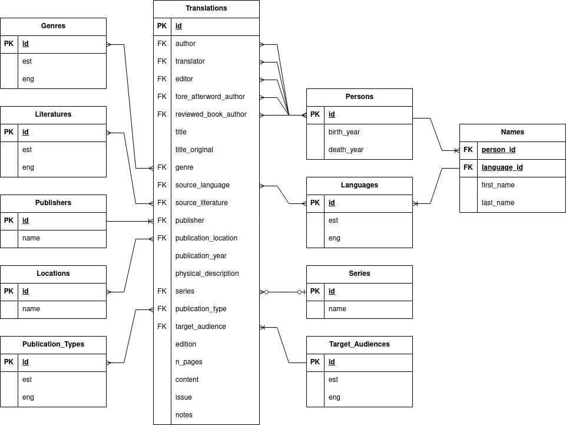

# Data description
The main data fields in the Estonian data tables are as follows:
- `genres`: the genre that the writing is considered to belong to. The names should generally be in plural form. Best practice says that the **values should be copy-pasted or "selected" from some dropdown menu, rather than manually inputed**. Manual inputation of a genre name should be a rare occasion and should be handled by proper database manipulation by a professional.
- `languages`: the language that the piece of writing was translated from. All lowercase, follows usual Estonian best practices. In case of combined names (e.g. "vana-rooma"), a hyphen is used in the middle. Best practice says that the **values should be copy-pasted or "selected" from some dropdown menu, rather than manually inputed**.
- `literatures`: the language or location of the original piece of writing. The database follows the genitive form (e.g. "eesti keel") of the source literature. Best practice says that the **values should be copy-pasted or "selected" from some dropdown menu, rather than manually inputed**.
- `locations`: the publication location, generally down to the city or the district. First letter capitalized. Can be manually inputed. Generally follows the Estonian location names and forms.
- `publication_types`: the type of the publication that the translated piece appeared in. In Estonian, can only have four values: `Kogumikus ilmunud tõlge`, `Perioodikas ilmunud tõlge`, `Tõlkearvustus`, `Tõlkeraamat`. **The values MUST be "selected" from some dropdown menu, rather than manually inputed.** **Every listing must only have one publication type.**
- `publishers` - the publishers of the piece of writing. Mostly usual Estonian naming standards. Both legacy Estonian naming (e.g. "rahwa") and new Estonian naming (e.g. "rahva") is allowed and present.
- `series` - the series where the translation was published. Currently mainly free-form: usually includes information about the series year, number and/or the name of the series. Examples: `Anton Tšehhov. Valitud teosed, 1`, `Elu lugemisvara nr 38/39`.
- `target_audiences` - the intended audience for the piece of writing. **Only two mutually excluding options: "Laste- ja noortekirjandus" and "Täiskasvanute ilukirjandus".** **The values MUST be "selected" from some dropdown menu.**
- `persons` - anything about the people: authors, translators, editors, fore- and afterword authors, reviewed book authors. Includes fields `first_name`, `last_name`, `birth_year`, `death_year`. In a full implementation, this information should be cross-checked with or fetched from an outside database (e.g. ESTER, RaRa) to avoid human errors.

The entity relation diagram (ER diagram) can be seen in the file `er_diagram_v3.0.drawio.png` or here:

